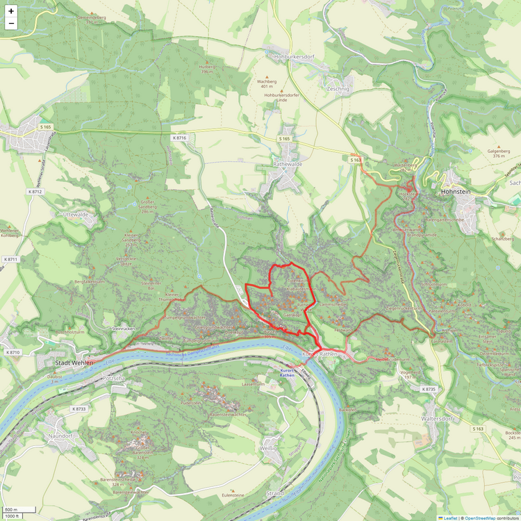

# running_hot
Generate heatmap from .gpx files.

## How-to

1. Get your hands on your .gpx files.
    1. If you use Strava: Request a full backup of your Strava data via https://www.strava.com/athlete/delete_your_account.
    1. Else: Or get your .gpx files from any other provider.
1. Built venv from [requirements.txt](requirements.txt).
1. If there are .fit or other files, convert them to .gpx first via [fit_to_gpx.py](fit_to_gpx.py).
1. Execute [gpx_to_map.py](gpx_to_map.py).

## Possible alternative packages:
* .gpx:
    * https://pypi.org/project/gpxpy/ <--most stars by far.
    * https://pypi.org/project/gpxplotter/
    * https://pypi.org/project/gpx-converter/
* .fit converter:
    * https://pypi.org/project/fitparse/
    * https://pypi.org/project/fit2gpx/

## Possible extensions
* Saving map:
    * https://stackoverflow.com/questions/66140534/how-to-save-a-map-section-in-python-using-folium
    * https://stackoverflow.com/questions/53565979/export-a-folium-map-as-a-png
